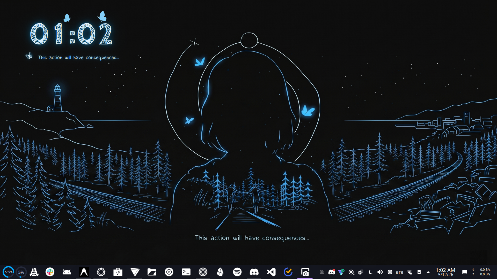

<h1 align="center">LiS Butterfly Clock 🦋</h1>

<p align="center">
  A <em>Life is Strange</em> inspired digital clock widget for <strong>KDE Plasma 6</strong>, featuring glitch animations, neon glow effects, and dynamically animated butterflies that track the changing digits.
</p>

<p align="center">
  
</p>

<p align="center">
  
</p>

## Features

- **12-Hour & 24-Hour Formats** with chalk-style typography (CabinSketch font)
- **Per-Digit Glitch Animation** — each digit flickers when it changes
- **Dynamic Butterflies** — Butterfly 1 tracks the minutes digit, Butterfly 2 tracks the hours digit
- **Neon Glow Effect** — ultra-smooth, clipping-free glow using Qt6 `MultiEffect`
- **Authentic Subtitle** — *"This action will have consequences..."* in Dudu Calligraphy font with a companion butterfly
- **Low Power Mode** — completely freeze all animations for maximum battery and CPU savings (0.8% footprint)
- **Fully Customizable** — change neon colors, text colors, butterfly colors, glow sharpness, and animation speeds
- **Visibility Controls** — toggle the top butterflies, subtitle, or AM/PM indicator on and off
- **Restore Defaults** button to reset everything with one click
- **Transparent Background** — blends seamlessly with any desktop wallpaper
- **Built for Plasma 6** — uses `PlasmoidItem`, JSON metadata, and high-performance Render Thread `Animator`s

## What You Need

- **KDE Plasma 6** — *Plasma 5 is not supported.*
- `kpackagetool6` — *(Usually included with `plasma-workspace` or `plasma-sdk`).*

---

## Installation

### Quick Install / Update (Recommended)

```bash
git clone https://github.com/shadi-maani/life-is-strange-butterfly-widget-clock.git
cd life-is-strange-butterfly-widget-clock
chmod +x install.sh
./install.sh
```

> **Note:** The `install.sh` script is smart. If the widget is already installed, running the script again without any arguments will **automatically update** it to the latest version while safely preserving all your custom settings.

### Manual Installation

1. Install fonts:
   ```bash
   mkdir -p ~/.local/share/fonts
   cp lis-clock/contents/assets/CabinSketch-Bold.ttf ~/.local/share/fonts/
   cp lis-clock/contents/assets/DuduCalligraphy.ttf ~/.local/share/fonts/
   fc-cache -f ~/.local/share/fonts
   ```
2. Install the widget:
   ```bash
   kpackagetool6 -t Plasma/Applet -i lis-clock
   ```

> **Note (For Manual Install Only):** If you are upgrading manually using the command above, use `-u` instead of `-i`. (If you used `install.sh`, it handles this automatically!)

---

## Usage

1. Right-click your desktop → **Add Widgets**
2. Search for **"LiS Butterfly Clock"**
3. Drag it onto your desktop
4. Right-click the widget → **Configure** to customize colors and animation speeds

### Customization Options

| Setting | Description | Default |
|---------|-------------|---------|
| Neon Glow Color | Color of the glow effect on digits and text | `#00aaff` |
| Clock Text Color | Color of the clock digits | `#dff2ff` |
| Subtitle Text Color | Color of the consequences text | `#dff2ff` |
| Top Butterflies Color | Color of the main animated butterflies | `#84cff9` |
| Wing Flap Speed | Butterfly wing animation speed (ms) | `180` |
| Floating Speed | Butterfly floating animation speed (ms) | `2800` |
| Glow Sharpness | Adjusts the radius and intensity of the neon blur | `16` |
| Subtitle Flicker Interval | How often the subtitle pulses (ms) | `5000` |
| Time Format | Toggle between 12-Hour and 24-Hour modes | `12-Hour` |
| Show AM/PM | Show or hide the AM/PM indicator (12-Hour only) | `Unchecked` |
| Show Top Butterflies | Hide or show the two main animated butterflies | `Checked` |
| Show Subtitle & Ghost Butterfly | Toggle the subtitle and bottom butterfly on or off | `Checked` |
| Low Power Mode | Completely freeze all animations for maximum battery/CPU savings | `Unchecked` |
| Subtitle Text | Custom text to display below the clock | *"This action..."* |

---

## Development

### Testing with plasmoidviewer

```bash
cd lis-clock
plasmoidviewer -a .
```

### Running the Validator

A built-in validation script checks for common Plasma 6 widget errors:

```bash
cd lis-clock
./validate.sh
```

This checks: file structure, metadata format, config schema sync, QML scope errors, asset integrity, and animation safety.

---

## Uninstallation

```bash
./install.sh --uninstall
```

Or manually:
```bash
kpackagetool6 -t Plasma/Applet -r com.shadi.lisclock
```

---

## Project Structure

```
lis-butterfly-clock/
├── install.sh
├── LICENSE
├── README.md
├── CONTRIBUTING.md
└── lis-clock/
    ├── metadata.json
    ├── validate.sh
    └── contents/
        ├── config/
        │   ├── main.xml
        │   └── config.qml
        ├── ui/
        │   ├── main.qml
        │   └── ConfigGeneral.qml
        └── assets/
            ├── CabinSketch-Bold.ttf
            ├── DuduCalligraphy.ttf
            ├── butterfly1.png
            ├── butterfly2.png
            └── darkroombutterfly3.png
```

---

## License

Released under the [MIT License](LICENSE).

*Note: CabinSketch font is licensed under the SIL Open Font License (OFL). Dudu Calligraphy is free for personal use.*

---

### *"This action will have consequences..."*
